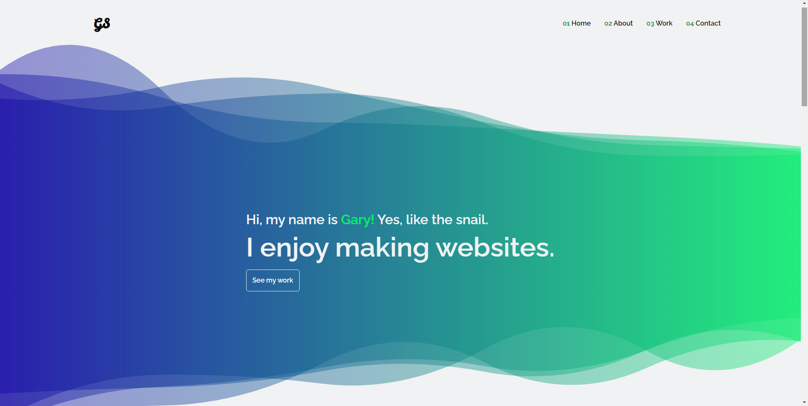

# My Personal Portfolio
Here you learn a bit about my background and see some of my work. If you like what you see or have some feedback for me, feel free to reach out!

**Link to project:** https://garysmith.dev

## How It's Made:

**Tech used:** HTML, CSS, JavaScript, React

My portfolio is a single page application broken down to 4 different sections, Home, About, Work, and Contact. Each navbar item had its own ref that was connected its respected section of the applciation. When one of the navbar items are clicked, the page will automatically scroll to section connected to the navbar item. This was mainly done using the useRef hook.

## Lessons Learned:
The two biggest things I learned from this project was learning to make a website responsive, being able to change the layout of elements on the page pending on the size of the screen the user is on, and being able to navigate to different parts of the same page by the navbar.

